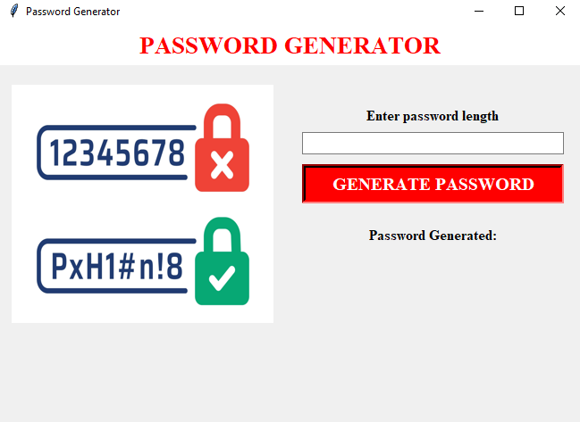

# password-generator-python
Password Generator using Python libraries such as random, tkinter. 
tkinter module is imported to build user interface. Random module is imported to generate a password of desired length.
This app is gonna take password length as input from user and generate a strong password of that length which consists of atleast one alphabet, one digit and one special character.
To acheive this we are adding a input field and a button in our app and when the button is clicked a function is called which generates a password if user input is valid else displays an error.

